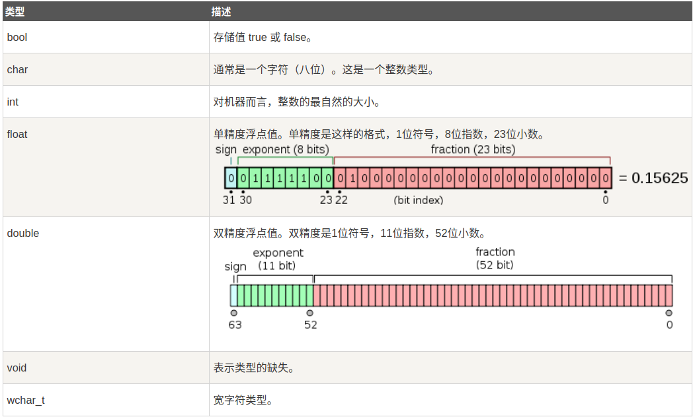

c++的基本数据类型
====
C++ 是一种静态类型的、编译式的、通用的、大小写敏感的、不规则的编程语言，
支持过程化编程、面向对象编程和泛型编程。
C++ 被认为是一种中级语言，它综合了高级语言和低级语言的特点。
C++ 是由 Bjarne Stroustrup 于 1979 年在新泽西州美利山贝尔实验室开始设计开发的。
C++ 进一步扩充和完善了 C 语言，最初命名为带类的C，后来在 1983 年更名为 C++。
C++ 是 C 的一个超集，事实上，任何合法的 C 程序都是合法的 C++ 程序。


面向对象程序设计
C++ 完全支持面向对象的程序设计，包括面向对象开发的四大特性：
------
* 封装
* 抽象
* 继承
* 多态

标准库
标准的 C++ 由三个重要部分组成：
=========
核心语言，提供了所有构件块，包括变量、数据类型和常量，等等。
C++ 标准库，提供了大量的函数，用于操作文件、字符串等。
标准模板库（STL），提供了大量的方法，用于操作数据结构等。

2015	ISO/IEC TS 19570:2015	       -	用于并行计算的扩展
2015	ISO/IEC TS 18822:2015	       -	文件系统
2014	ISO/IEC 14882:2014	         C++14	第四个C++标准
2011	ISO/IEC TR 24733:2011	       -	十进制浮点数扩展
2011	ISO/IEC 14882:2011	         C++11	第三个C++标准
2010	ISO/IEC TR 29124:2010	       -	数学函数扩展
2007	ISO/IEC TR 19768:2007	     C++TR1	C++技术报告：库扩展
2006	ISO/IEC TR 18015:2006	       -	C++性能技术报告
2003	ISO/IEC 14882:2003	         C++03	第二个C++标准
1998	ISO/IEC 14882:1998	         C++98	第一个C++标准

gcc编译命令
```
gcc main.cpp -lstdc++ -o main
```
g++编译命令
程序 g++ 是将 gcc 默认语言设为 C++ 的一个特殊的版本，
链接时它自动使用 C++ 标准库而不用 C 标准库。通过遵循源码
的命名规范并指定对应库的名字，用 gcc 来编译链接 C++ 程序是可行的.

```
g++ main.cpp -o main
```
编译多个文件
```
g++ runoob1.cpp runoob2.cpp -o runoob
```

g++ 常用命令选项
选项	解释
-ansi	只支持 ANSI 标准的 C 语法。这一选项将禁止 GNU C 的某些特色， 例如 asm 或 typeof 关键词。
-c	只编译并生成目标文件。
-DMACRO	以字符串"1"定义 MACRO 宏。
-DMACRO=DEFN	以字符串"DEFN"定义 MACRO 宏。
-E	只运行 C 预编译器。
-g	生成调试信息。GNU 调试器可利用该信息。
-IDIRECTORY	指定额外的头文件搜索路径DIRECTORY。
-LDIRECTORY	指定额外的函数库搜索路径DIRECTORY。
-lLIBRARY	连接时搜索指定的函数库LIBRARY。
-m486	针对 486 进行代码优化。
-o	FILE 生成指定的输出文件。用在生成可执行文件时。
-O0	不进行优化处理。
-O	或 -O1 优化生成代码。
-O2	进一步优化。
-O3	比 -O2 更进一步优化，包括 inline 函数。
-shared	生成共享目标文件。通常用在建立共享库时。
-static	禁止使用共享连接。
-UMACRO	取消对 MACRO 宏的定义。
-w	不生成任何警告信息。
-Wall	生成所有警告信息。


C++ 基本语法
=======

C++ 程序可以定义为对象的集合，这些对象通过调用彼此的方法进行交互。

* 对象 - 对象具有状态和行为。例如：一只狗的状态 - 颜色、名称、品种，行为 - 摇动、叫唤、吃。对象是类的实例。
* 类 - 类可以定义为描述对象行为/状态的模板/蓝图。
* 方法 - 从基本上说，一个方法表示一种行为。一个类可以包含多个方法。
可以在方法中写入逻辑、操作数据以及执行所有的动作。
* 即时变量 - 每个对象都有其独特的即时变量。对象的状态是由这些即时变量的值创建的。

C++ 关键字
======
asm	   else	    new	        this
auto	enum	operator	throw
bool	explicit	private	true
break	export	protected	try
case	extern	public	typedef
catch	false	register	typeid
char	float	reinterpret_cast	typename
class	for	return	union
const	friend	short	unsigned
const_cast	goto	signed	using
continue	if	sizeof	virtual
default	inline	static	void
delete	int	static_cast	volatile
do	long	struct	wchar_t
double	mutable	switch	while
dynamic_cast	namespace	template

三字符组
======

三字符组就是用于表示另一个字符的三个字符序列，又称为三字符序列。三字符序列总是以两个问号开头。
三字符序列不太常见，但 C++ 标准允许把某些字符指定为三字符序列。以前为了表示键盘上没有的字符，这是必不可少的一种方法。
三字符序列可以出现在任何地方，包括字符串、字符序列、注释和预处理指令。
下面列出了最常用的三字符序列：


C++ 注释
=====

/* 这是注释 */
 
/* C++ 注释也可以
 * 跨行
 */

C++ 数据类型
====
C++ 为程序员提供了种类丰富的内置数据类型和用户自定义的数据类型。下表列出了七种基本的 C++ 数据类型:

布尔型	bool
字符型	char
整型	    int
浮点型	float
双浮点型	double
无类型	void
宽字符型	wchar_t

typedef short int wchar_t;

typedef 声明
您可以使用 typedef 为一个已有的类型取一个新的名字。下面是使用 typedef 定义一个新类型的语法:
typedef int feet;
feet distance;

枚举类型
======

枚举类型(enumeration)是C++中的一种派生数据类型，它是由用户定义的若干枚举常量的集合。

如果一个变量只有几种可能的值，可以定义为枚举(enumeration)类型。所谓"枚举"是指将变量的值一一列举出来，变量的值只能在列举出来的值的范围内。

创建枚举，需要使用关键字 enum。枚举类型的一般形式为

C++变量类型
====


C++ 中的左值(Lvalues)和右值(Rvalues)

C++ 中有两种类型的表达式：

左值(lvalue)：指向内存位置的表达式被称为左值（lvalue）表达式。左值可以出现在赋值号的左边或右边。
右值(rvalue)：术语右值(rvalue)指的是存储在内存中某些地址的数值。右值是不能对其进行赋值的表达式，
也就是说，右值可以出现在赋值号的右边，但不能出现在赋值号的左边。
变量是左值，因此可以出现在赋值号的左边。数值型的字面值是右值，因此不能被赋值，不能出现在赋值号的左边。
下面是一个有效的语句.


C++ 变量作用域
作用域是程序的一个区域，一般来说有三个地方可以定义变量：
在函数或一个代码块内部声明的变量，称为局部变量。
在函数参数的定义中声明的变量，称为形式参数。
在所有函数外部声明的变量，称为全局变量。


全局变量
在所有函数外部定义的变量（通常是在程序的头部），称为全局变量。全局变量的值在程序的整个生命周期内都是有效的。
全局变量可以被任何函数访问。也就是说，全局变量一旦声明，在整个程序中都是可用的。

整数常量
整数常量可以是十进制、八进制或十六进制的常量。
前缀指定基数：0x 或 0X 表示十六进制，0 表示八进制，不带前缀则默认表示十进制。
整数常量也可以带一个后缀，后缀是U和L的组合，U表示无符号整数(unsigned),
L表示长整数(long)。后缀可以是大写，也可以是小写，U和L的顺序任意。

以下是各种类型的整数常量的实例：
85         // 十进制
0213       // 八进制 
0x4b       // 十六进制 
30         // 整数 
30u        // 无符号整数 
30l        // 长整数 
30ul       // 无符号长整数


浮点常量
浮点常量由整数部分、小数点、小数部分和指数部分组成。
您可以使用小数形式或者指数形式来表示浮点常量。
当使用小数形式表示时，必须包含整数部分、小数部分，或同时包含两者。
当使用指数形式表示时， 必须包含小数点、指数，或同时包含两者。
带符号的指数是用 e 或 E 引入的.


定义常量
在 C++ 中，有两种简单的定义常量的方式：

* 使用 #define 预处理器。
* 使用 const 关键字。


C++ 修饰符类型
C++ 允许在 char、int 和 double 数据类型前放置修饰符。修饰符用于改变基本类型的含义，所以它更能满足各种情境的需求。

下面列出了数据类型修饰符：

* signed
* unsigned
* long
* short
修饰符 signed、unsigned、long 和 short 可应用于整型，signed 和 unsigned 可应用于字符型，long 可应用于双精度型。
修饰符 signed 和 unsigned 也可以作为 long 或 short 修饰符的前缀。例如：unsigned long int。
C++ 允许使用速记符号来声明无符号短整数或无符号长整数。您可以不写 int，只写单词 unsigned、short 或 unsigned、long，int 是隐含的。例如，下面的两个语句都声明了无符号整型变量。

C++ 中的类型限定符
类型限定符提供了变量的额外信息。

限定符	含义
* const:const类型的对象在程序执行期间不能被修改改变。
* volatile:修饰符volatile告诉编译器不需要优化volatile声明的变量，让程序可以直接从内存中读取变量。
对于一般的变量编译器会对变量进行优化，将内存中的变量值放在寄存器中以加快读写效率。
* restrict:由restrict修饰的指针是唯一一种访问它所指向的对象的方式。
只有C99增加了新的类型限定符restrict。


C++ 存储类
==== 
存储类定义 C++ 程序中变量/函数的范围（可见性）和生命周期。这些说明符放置在它们所修饰的类型之前。下面列出 C++ 程序中可用的存储类：
* auto
* register
* static
* extern
* mutable
* thread_local (C++11)
从 C++ 11 开始，auto 关键字不再是 C++ 存储类说明符，且 register 关键字被弃用.

* auto 存储类
自 C++ 11 以来，auto 关键字用于两种情况：声明变量时根据初始化表达式自动推断该变量的类型、声明函数时函数返回值的占位符。
C++98标准中auto关键字用于自动变量的声明，但由于使用极少且多余，在C++11中已删除这一用法。
auto f=3.14;      //double
auto s("hello");  //const char*
auto z = new auto(9); // int*
auto x1 = 5, x2 = 5.0, x3='r';//错误，必须是初始化为同一类型


*  register 存储类
register 存储类用于定义存储在寄存器中而不是 RAM 中的局部变量。这意味着变量的最大尺寸等于寄存器的大小（通常是一个词），且不能对它应用一元的 '&' 运算符（因为它没有内存位置）。
{
   register int  miles;
}
寄存器只用于需要快速访问的变量，比如计数器。还应注意的是，定义 'register' 并不意味着变量将被存储在寄存器中，它意味着变量可能存储在寄存器中，这取决于硬件和实现的限制。

* static 存储类
static 存储类指示编译器在程序的生命周期内保持局部变量的存在，而不需要在每次它进入和离开作用域时进行创建和销毁。因此，使用 static 修饰局部变量可以在函数调用之间保持局部变量的值。
static 修饰符也可以应用于全局变量。当 static 修饰全局变量时，会使变量的作用域限制在声明它的文件内。
在 C++ 中，当static用在类数据成员上时，会导致仅有一个该成员的副本被类的所有对象共享。

* extern 存储类
extern 存储类用于提供一个全局变量的引用，全局变量对所有的程序文件都是可见的。当您使用 'extern' 时，对于无法初始化的变量，会把变量名指向一个之前定义过的存储位置。
当您有多个文件且定义了一个可以在其他文件中使用的全局变量或函数时，可以在其他文件中使用 extern 来得到已定义的变量或函数的引用。可以这么理解，extern 是用来在另一个文件中声明一个全局变量或函数。
extern 修饰符通常用于当有两个或多个文件共享相同的全局变量或函数的时候：


* mutable 存储类
mutable 说明符仅适用于类的对象，这将在本教程的最后进行讲解。它允许对象的成员替代常量。也就是说，mutable 成员可以通过 const 成员函数修改。

* thread_local 存储类
使用 thread_local 说明符声明的变量仅可在它在其上创建的线程上访问。 变量在创建线程时创建，并在销毁线程时销毁。 每个线程都有其自己的变量副本。

thread_local 说明符可以与 static 或 extern 合并。
可以将 thread_local 仅应用于数据声明和定义，thread_local 不能用于函数声明或定义。


http://www.runoob.com/cplusplus/cpp-storage-classes.html


