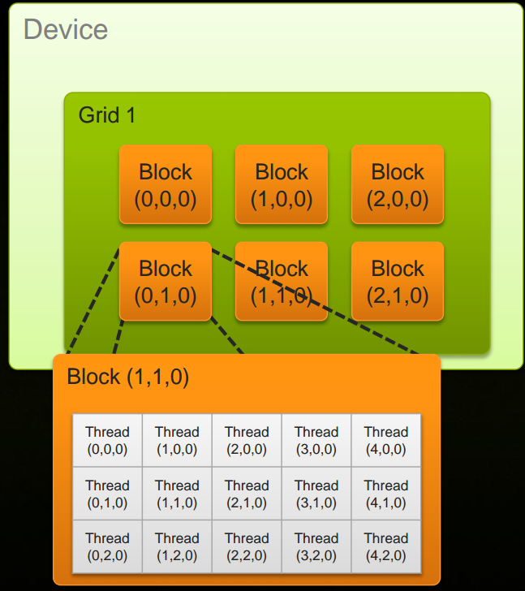

cuda tutorial
========

1.NVIDIA介绍</br>
* 面向游戏业务的GeForce
* 面向专业图形图像领域的Quadro
* 面向企业级计算的Tesla
* 面向嵌入式计算的Tegra
* 面向虚拟化应用的Grid</br>

2.NVIDIA深度学习SDK：cuDNN,TensorRT,NCCL</br>
* [cuDNN](https://docs.nvidia.com/deeplearning/sdk/cudnn-archived/index.html):　CUDNN设计的最主要目标，性能是第一位，其次是灵活性。它主要针对Deep Learning的training工具设计的.</br>
* [NCCL](https://docs.nvidia.com/deeplearning/sdk/nccl-archived/index.html):　NCCL主要是为了加速在多GPU环境，同时用多块GPU做training的时候，它做出一个同步，或者说Reduction时候，加速collective的过程.在做数据传输的时候，把大块数据切成小块，同时利用系统里面的多条链路，比如现在是PCI-E链路，同时利用PCI-E的上行和下行，尽量去避免不同的数据同时用某一个上行或者下行通道，可能会造成数据的contention，大大降低传输效率.</br>
* [TensorRT](https://docs.nvidia.com/deeplearning/sdk/tensorrt-developer-guide/index.html):　TENSORRT的目标很简单，当你训练好了网络，需要部署的时候，能够尽量地加速线上的inference的throughput。TENSORRT跟CUDNN最大的区别在于，CUDNN里面的API都是ProModule，或者说ProLayer,也就是说，在优化卷积的时候，我只知道卷积的参数，然后再做优化；而输入给TENSORRT的信息，是包含整个网络的信息.</br>


## 1. cuda C++并行编程
### 1.1 heterogenous computing(异构计算)</br>
cpu <==> host　运行serial函数和代码</br>
gpu <==> device 运行paraller函数和代码</br>

### 1.2 gpu计算过程</br>
```
1.在GPU上申请内存空间.cudaMalloc();
2.将数据拷贝从host拷贝到device中.cudaMemcpy();
3.GPU并行计算.<<< >>>;cudaDeviceSynchronize();
4.将数据从device拷贝会host中.cudaMemcpy();
5.释放GPU上的内存空间.cudaFree();

or 

1.在GPU上申请内存空间.cudaMallocManaged();
2.GPU并行计算.<<< >>>;cudaDeviceSynchronize();
3.释放GPU上的内存空间.cudaFree();

```
### 1.3 parallel</br>

* add<<<1,1>>>()  => add<<<N,1>>>()  等价与N times is parallel</br>
blockIdx.x  N个block</br>
* add<<<1,1>>>()  => add<<<1,N>>>()  等价于N times is parallel</br>
threadIdx.x  N个thread</br>
* add<<<1,1>>>()  => add<<<(N+M-1)/M,M>>>() </br>
int index= threadId.x+blockIdx.x*M;  </br>

* add<<<1,1>>>()  => add<<<dim3(2,2,1),dim3(4,1,1)>>>()</br>
blockIdx.x　　threadIdx.x </br>
blockIdx.y　　threadIdx.y </br>
blockIdx.z　　threadIdx.z </br>

### 1.4 IDS and dimensions:</br>



### 1.5 共享内存</br>

```
__shared__ float array;
#do something
__syncthreads();
# 等待共享内存操作完成.</br>

```

### 1.6 cuda 的内存种类</br>
* registers(read_write per_thread)
* local memory(read_write per_thread)
* shared memory(read_write per_thread)
* global memory(read_write per_grid)
* constant memory(read_only per_grid)
* texture memory(read_only per_grid)

### 1.7调试
内存泄漏检测:
---
```apple js
>> valgrind --tool=memcheck --leak-check=yes ./out

```
cuda命令行编译
---
```
>>> nvcc filename.cu -o filename
>>> nvprof ./filename

```

## 2. TensorRT</br>
　　TensorRT是一种高性能神经网络推理(Inference)引擎，用于在生产环境中部署深度学习应用程序，应用有图像分类、分割和目标检测等，可提供最大的推理吞吐量和效率。TensorRT是第一款可编程推理加速器，能加速现有和未来的网络架构。TensorRT需要CUDA的支持。TensorRT包含一个为优化生产环境中部署的深度学习模型而创建的库，可获取经过训练的神经网络(通常使用32位或16位数据)，并针对降低精度的INT8运算来优化这些网络。借助CUDA的可编程性，TensorRT将能够加速助推深度神经网络日益多样化、复杂的增长趋势。通过TensorRT的大幅度加速，服务提供商能够以经济实惠的成本部署这些计算密集型人工智能工作负载.</br>

### 2.1 介绍</br>
[demo](https://github.com/NVIDIA-Jetson/tf_to_trt_image_classification)

### 2.2安装教程</br>
[安装教程](https://blog.csdn.net/MacwinWin/article/details/80177326)

